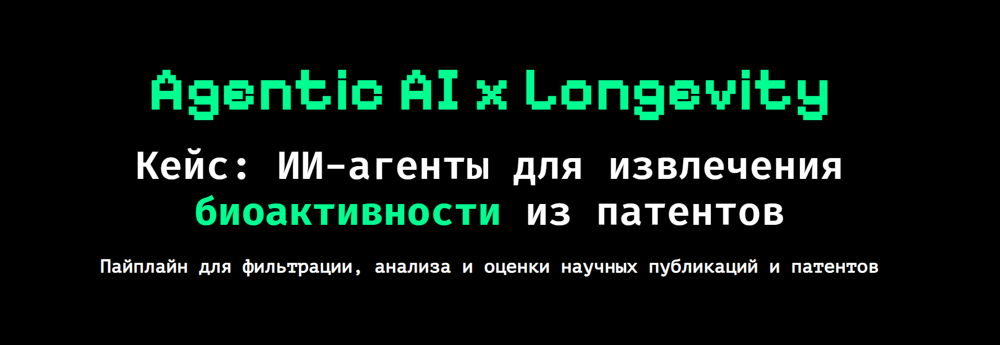
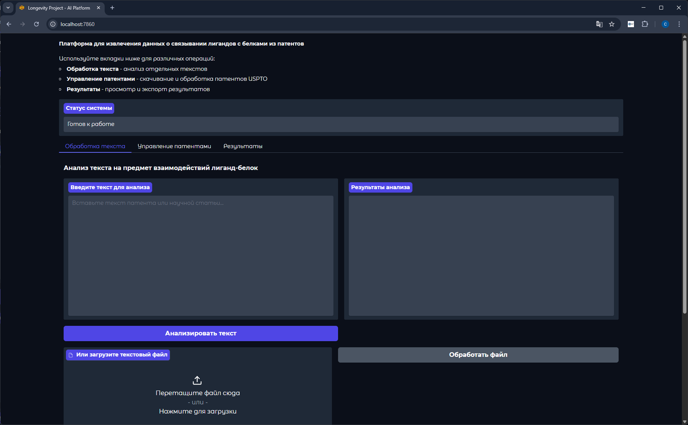
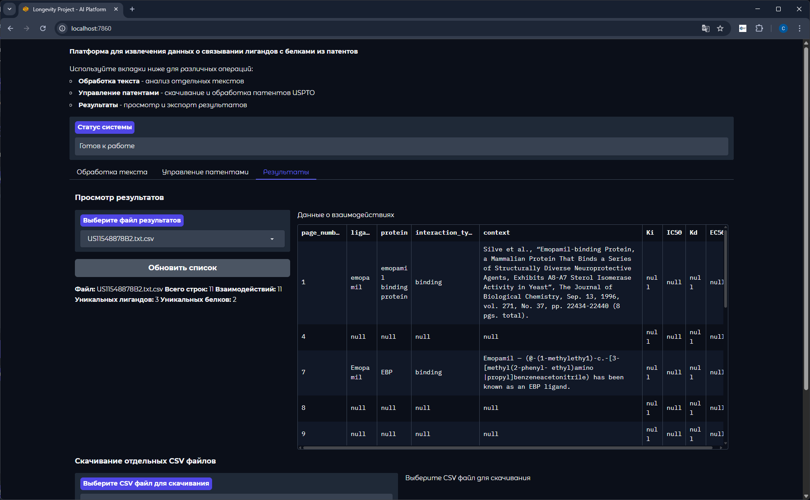
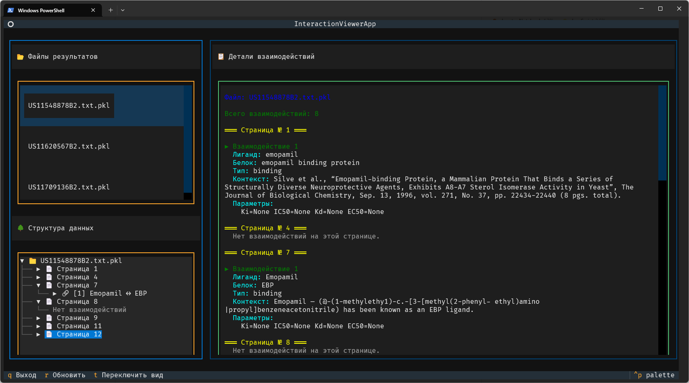
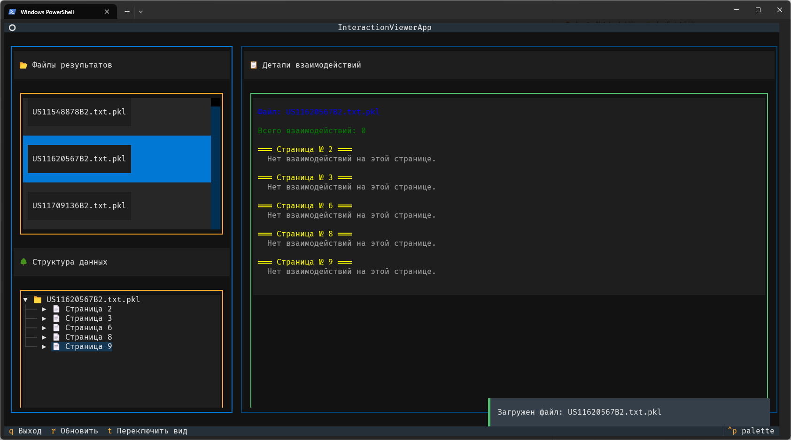

<a href="README.md">
   
</a>

This project creates an extracted dataset of ligand-protein binding interactions in CSV format with required fields. The dataset is generated using an API for patent search, followed by processing and data extraction.

The project uses [uv](https://docs.astral.sh/uv/) for dependency and project management. Code formatting and linting is handled by [ruff](https://github.com/astral-sh/ruff).

## Usage

> [!IMPORTANT]
> The project requires an API key from USPTO PatentsView. You can obtain one [here](https://patentsview-support.atlassian.net/servicedesk/customer/portal/1/group/1/create/18). Applications are typically approved within 1-2 days.

### Dependencies Installation

Required dependencies:
- [Python 3.13](https://www.python.org/downloads/release/python-3130/) (versions 3.10+ are supported)
- [Tesseract OCR](https://github.com/tesseract-ocr/tesseract)
- [Ollama](https://ollama.ai/)

You'll need to choose an appropriate model for text processing. The project uses the `qwen3` model by default. To download it, run:

```bash
ollama pull qwen3
```

#### Running the Project

1. Clone the repository:
   ```bash
   git clone https://github.com/fresh-milkshake/agentic_ai_x_longevity
   ```

2. Install Python dependencies using `uv` (or `poetry`):
   ```bash
   uv sync
   ```

> [!NOTE]
> You can install `uv` using `pip`:
>
> ```bash
> pip install uv
> ```

3. Create a `.env` file based on `.env.example` in the project root and add your USPTO API key:
   ```bash
   USPTO_API_KEY=your_api_key
   ```

   In the future, I plan to find and add the ability to work without API keys if possible, to make the project more accessible.

4. Run the script:
   ```bash
   uv run main.py
   ```
   or
   ```bash
   python main.py
   ```
   When using python directly, ensure you're running from a virtual environment with all Python dependencies installed.

#### Running Gradio UI

> [!WARNING]
> Not all Gradio UI functions are fully debugged and may work incorrectly. For the best experience, it's recommended to use the standard project launch via `uv run main.py`.

The project uses Gradio to create a user-friendly web interface with the ability to run various project stages both individually and in a unified pipeline.

To launch the interface, run:

```bash
uv run gradio-ui.py
```

<kbd>
   <p>
    
    
   </p>
</kbd>

#### Running Intermediate Results Review Script

To review intermediate results in pickle file format created during agent processing, you can use the TUI script:

```bash
uv run interactive_view_pkl.py
```

<kbd>
   <p>
    
    
   </p>
</kbd>

## Project Structure

```
├── patents/                 # Patents (PDF)
│   └── *.pdf                # Patent documents
├── results/                 # Processing results
│   ├── intermediate/        # Intermediate data
│   │   └── *.pkl            # Serialized data from agents
│   ├── final/               # Final results
│   │   └── *.csv            # CSV files with results
│   └── raw/                 # Raw data
│       └── *.txt            # Text versions of documents
├── src/                     # Main code
│   ├── constants            # Project constants and settings
│   │   └── ...
│   ├── evaluation           # Dataset evaluation script
│   │   └── ...
│   ├── filtering            # Patent search and download from USPTO
│   │   └── ...
│   ├── processing           # Data processing
│   │   ├── pipeline.py      # Main AI agents pipeline
│   │   └── ...
│   ├── orchestration        # Orchestrator
│   │   └── ...
│   ├── models.py            # ML models for use in agents
│   └── utils.py             # Helper functions for agents
├── main.py                  # Entry point
├── gradio-ui.py             # Gradio web interface
├── pyproject.toml
├── README.md 
├── README_EN.md             # This file
├── .env.example
└── .env
```

## License

This project is published under the MIT License. See [LICENSE](LICENSE.txt) for details.
