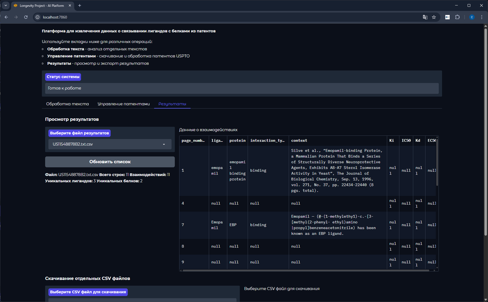
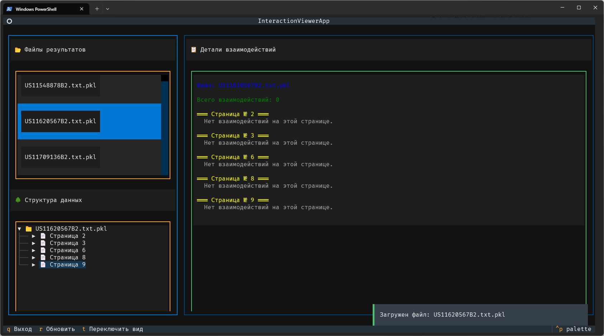

<a href="README.eng.md">
   
</a>

Этот проект создает извлеченный набор данных о связывании лигандов с белками в формате CSV-таблицы с требуемыми полями. Датасет создается с помощью API для поиска патентов, их дальнейшей обработки и извлечения данных.

Для управления зависимостями и проектом используется [uv](https://docs.astral.sh/uv/). Форматтер и линтер - [ruff](https://github.com/astral-sh/ruff).

## Использование

> [!IMPORTANT]
> Для работы проекта требуется API-ключ от USPTO PatentsView. Получить его можно [здесь](https://patentsview-support.atlassian.net/servicedesk/customer/portal/1/group/1/create/18). Заявку одобряют в течение 1-2 дней.

### Установка зависимостей

Необходимые зависимости:
- [Python 3.13](https://www.python.org/downloads/release/python-3130/) (можно использовать версии от 3.10)
- [Tesseract OCR](https://github.com/tesseract-ocr/tesseract)
- [Ollama](https://ollama.ai/)

Необходимо будет выбрать подходящую модель для работы с текстом. В проекте по умолчанию используется модель `qwen3`. Для ее скачивания необходимо выполнить команду:

```bash
ollama pull qwen3
```

#### Запуск проекта

1. Клонируйте репозиторий:
   ```bash
   git clone https://github.com/fresh-milkshake/agentic_ai_x_longevity
   ```
2. Установите Python зависимости при помощи `uv` (или `poetry`):
   ```bash
   uv sync
   ```

> [!NOTE]
> Скачать `uv` можно при помощи `pip`:
>
> ```bash
> pip install uv
> ```

1. Создайте файл `.env` по образцу `.env.example` в корне проекта и добавьте в него API-ключ от USPTO:
   ```bash
   USPTO_API_KEY=your_api_key
   ```

   В дальнейшем я планирую найти и добавить возможность обойтись без использования API ключей, если это будет возможно, для большей доступности проекта.

2. Запустите скрипт:
   ```
   uv run main.py
   ```
   или
   ```
   python main.py
   ```
   но в случае с python - необходимо убедиться что запуск происходит из виртуального окружения, в котором установлены все Python зависимости.

#### Запуск Gradio UI

> [!WARNING]
> Не все функции Gradio UI отлажены и могут работать некорректно. Для лучшего опыта рекомендуется использовать стандартный запуск проекта через `uv run main.py`.

В проекте используется Gradio для создания user-friendly веб-интерфейса с возможностью запуска различных этапов проекта как по отдельности, так и в едином пайплайне.
Для запуска интерфейса необходимо выполнить команду:

```bash
uv run gradio-ui.py
```

<kbd>
   <p>
    
    
   </p>
</kbd>

#### Запуск скрипта обзора промежуточных результатов

Для обзора промежуточных результатов в формате pickle файлов, которые создаются в процессе работы агентов, можно использовать TUI скрипт:

```bash
uv run interactive_view_pkl.py
```

<kbd>
   <p>
    
    
   </p>
</kbd>

## Структура проекта

```
├── patents/                 # Патенты (PDF)
│   └── *.pdf
├── results/                 # Результаты обработки
│   ├── intermediate/        # Промежуточные данные
│   │   └── *.pkl            # Сериализованные данные от агентов
│   ├── final/               # Финальные результаты
│   │   └── *.csv            # CSV-файлы с результатами
│   └── raw/                 # Необработанные данные
│       └── *.txt            # Текстовые версии документов
├── src/                     # Основной код
│   ├── constants            # Константы и настройки проекта
│   │   └── ...
│   ├── evaluation           # Скрипт для оценки датасета
│   │   └── ...
│   ├── filtering            # Поиск и скачивание патентов с USPTO
│   │   └── ...
│   ├── processing           # Обработка данных
│   │   ├── pipeline.py      # Основной пайплайн ИИ-агентов
│   │   └── ...
│   ├── orchestration        # Оркестратор
│   │   └── ...
│   ├── models.py            # ML-модели для агентов
│   └── utils.py             # Вспомогательные функции для агентов
├── main.py                  # Точка входа
├── gradio-ui.py             # Веб-интерфейс на Gradio
├── pyproject.toml
├── README.md                # Этот файл
├── README.eng.md
├── .env.example
└── .env
```

## Лицензия

Проект опубликован под лицензией MIT. Для деталей см. [LICENSE](LICENSE.txt).